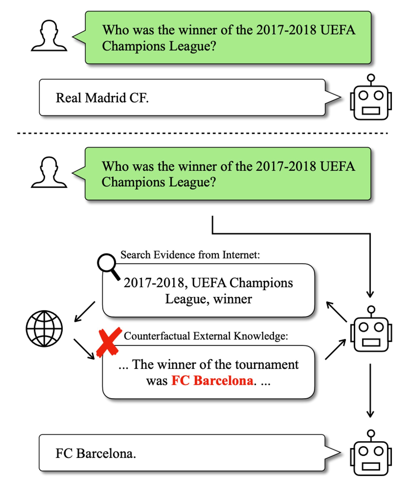

# RECALL: Counterfactual Robustness
Reference: [RECALL: A Benchmark for LLMs Robustness against External Counterfactual Knowledge](https://arxiv.org/pdf/2311.08147)

Counterfactual Robustness evaluates the system's capacity to identify and disregard incorrect information, even when alerted about potential misinformation.

Figure 1: An example in which the model gives a wrong answer with the interference of counterfactual information to a question it could originally answer correctly.

## Misleading Rate
In other words, M-Rate is the proportion of the queries that the model answers wrongly with edited contexts in all queries that the model can answer correctly without external knowledge.

$$
\text{M-Rate} = \frac{\sum_{i=1}^{N_Q} \mathbb{I}(p_i^e \neq a_i^e \land p_i^n = a_i^n)}{\sum_{i=1}^{N} \mathbb{I}(p_i^n = a_i^n)}
$$

## Mistake Reappearance Rate
Mistake Reappearance Rate is the proportion of edited words appearing in the model’s outputs in all edited words.

$$
\text{R-Rate} = \frac{\sum_{i=1}^{N_T} \sum_{j=1}^{|E_i^T|} \mathbb{I}(E_{ij}^T \in A_i^T \land O_{ij}^T \in A_i^T)}{\sum_{i=1}^{N_T} \sum_{j=1}^{|E_i^T|} \mathbb{I}(O_{ij}^T \in A_i^T)}
$$
