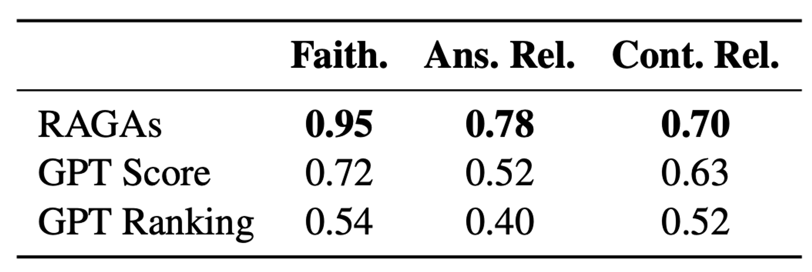

# RAGAS: Automated Evaluation of Retrieval Augmented Generation
Website: https://docs.ragas.io/en/stable/

RAGAS introduces a set of metrics for evaluating RAG systems across multiple dimensions:

1. Retrieval effectiveness in finding relevant and focused context
2. LLM's ability to use these contexts accurately
3. Overall generation quality

These metrics don't require human-annotated ground truth, potentially accelerating RAG system evaluation. Also, the RAGAS documentation provides clear, step-by-step explanations for computing each metric.

The authors created WikiEval, a small dataset of 50 test cases, to compare RAGAS metrics with human judgments on faithfulness, answer relevance, and context relevance. Their experiments show strong correlation between RAGAS metrics and human assessments. They compared RAGAS with two baseline models:

1. GPT Score: ChatGPT rates quality dimensions from 0-10 based on metric definitions.
2. GPT Ranking: ChatGPT selects preferred answers/contexts based on quality metrics.

Table 1: Agreement with human annotators in pairwise comparisons of faithfulness, answer relevance and context relevance, using the WikEval dataset (accuracy).

- Faithfulness: RAGAS predictions are highly accurate.
- Answer Relevance: Lower agreement, often due to subtle differences between candidate answers.
- Context Relevance: Most challenging to evaluate, with ChatGPT struggling to identify crucial information in longer contexts.

This analysis suggests RAGAS offers a promising approach for efficient, automated RAG system evaluation.

Overall, RAGAS offers two categories of metrics:

1. Metrics without ground truth requirements: [These are the metrics previously discussed]
2. Metrics requiring ground truth answers:
    - Context Precision
    - Context Recall
    - Context Entities Recall
    - Answer Semantic Similarity
    - Answer Correctness

These ground truth-based metrics provide additional evaluation dimensions but require human-annotated data. They offer a more comprehensive assessment of RAG system performance, particularly in scenarios where high accuracy is crucial and resources are available for creating annotated datasets.