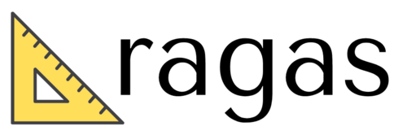

# RAG System Evaluation

The evaluation of Retrieval-Augmented Generation (RAG) systems encompasses multiple dimensions, each assessing different aspects of system performance. This section outlines various methodologies, grouped according to key evaluation dimensions. 

These approaches aim to provide a comprehensive assessment of RAG systems, covering aspects such as retrieval quality, generation accuracy, and overall system effectiveness.

## Legend
- **Q:** Question
- **RC:** Retrieved Context
- **GTC:** GroundTruth Context
- **GA:** Generated Answer
- **GTA:** GroundTruth Answer

## Retrieval
| Metric | Type | Q  | RC | GTC | GA | GTA |
| :----- | :--- | :- | :- | :-- | :- | :-- |
| [Haystack: Diversity](notes/additional_requirement/Haystack_diversity.md) | Semantic Similarity | | :white_check_mark: | | | |
| [MultiHop-RAG: Retrieval Evaluation](notes/retrieval/MultiHop-RAG_retrieval-evaluation.md) | IR Metrics | | :white_check_mark: | :white_check_mark: | | |
| [ARES: Context Relevance](notes/retrieval/ARES_context-relevance.md) | LLM classifier | :white_check_mark: | :white_check_mark: | | | |
| [RAGAS: Context Relevance](notes/retrieval/RAGAS_context-relevance.md) | LLM-as-a-judge | :white_check_mark: | :white_check_mark: | | | |
| [TruLens: Context Relevance](notes/retrieval/TruLens_context-relevance.md) | LLM-as-a-judge | :white_check_mark: | :white_check_mark: | | | |
| **Metric** | **Type** | **Q** | **RC** | **GTC** | **GA** | **GTA** |
| [RAGAS: Context Entity Recall](notes/retrieval/RAGAS_context-entities-recall.md) | LLM-as-a-tool, Entity Recall | | :white_check_mark: | | | :white_check_mark: |
| [RAGAS: Context Precision](notes/retrieval/RAGAS_context-precision.md) | LLM-as-a-judge, IR Metrics | :white_check_mark: | :white_check_mark: | | | :white_check_mark: |
| [RAGAS: Context Recall](notes/retrieval/RAGAS_context-recall.md) | LLM-as-a-judge | :white_check_mark: | :white_check_mark: | | | :white_check_mark: |

## Generation
| Metric | Type | Q  | RC | GTC | GA | GTA |
| :----- | :--- | :- | :- | :-- | :- | :-- |
| [RAGAS: Answer Correctness](notes/generation/RAGAS_answer-correctness.md) | LLM-as-a-tool, Factual Consistency | | | | :white_check_mark: | :white_check_mark: |
| [MultiHop-RAG: Response Evaluation](notes/generation/MultiHop-RAG_response-evaluation.md) | Exact Match | | | | :white_check_mark: | :white_check_mark: |
| [RGB: Information Integration](notes/additional_requirement/RGB_information-integration.md) | Exact Match | | | | :white_check_mark: | :white_check_mark: |
| [BLEU](notes/generation/BLEU.md) | Token-wise Accuracy | | | | :white_check_mark: | :white_check_mark: |
| [ROUGE](notes/generation/ROUGE.md) | Token-wise Accuracy | | | | :white_check_mark: | :white_check_mark: |
| **Metric** | **Type** | **Q** | **RC** | **GTC** | **GA** | **GTA** |
| [CDQA: F1-recall](notes/generation/CDQA_F1-recall.md) | Token-wise Accuracy | | | | :white_check_mark: | :white_check_mark: |
| [BERTScore](notes/generation/BERTScore.md) | Semantic Similarity, Token-wise Accuracy | | | | :white_check_mark: | :white_check_mark: |
| [LangChain: EmbeddingDistance](notes/generation/LangChain_embedding-distance.md) | Semantic Similarity | | | | :white_check_mark: | :white_check_mark: |
| [RAGAS: Answer Semantic Similarity](notes/generation/RAGAS_answer-semantic-similarity.md) | Semantic Similarity | | | | :white_check_mark: | :white_check_mark: |
| [RECALL: Counterfactual Robustness](notes/additional_requirement/RECALL_counterfactual-robustness.md) | Exact Match | | | | :white_check_mark: | :white_check_mark: |
| **Metric** | **Type** | **Q** | **RC** | **GTC** | **GA** | **GTA** |
| [RGB: Counterfactual Robustness](notes/additional_requirement/RGB_counterfactual-robustness.md) | Exact Match | | | | :white_check_mark: | :white_check_mark: |
| [RGB: Negative Rejection](notes/additional_requirement/RGB_negative-rejection.md) | Exact Match | | | | :white_check_mark: | :white_check_mark: |
| [RGB: Noise Robustness](notes/additional_requirement/RGB_noise-robustness.md) | Exact Match | | | | :white_check_mark: | :white_check_mark: |
| [LangChain: Accuracy](notes/generation/LangChain_accuracy.md) | LLM-as-a-judge | :white_check_mark: | | | :white_check_mark: | :white_check_mark: |
| [CRUD: RAGQuestEval](notes/generation/CRUD_RAGQuestEval.md) | Token-wise Accuracy | | | :white_check_mark: | :white_check_mark: | |
| **Metric** | **Type** | **Q** | **RC** | **GTC** | **GA** | **GTA** |
| [ARES: Answer Faithfulness](notes/generation/ARES_answer-faithfulness.md) | LLM classifier | | :white_check_mark: | | :white_check_mark: | |
| [RAGAS: Faithfulness](notes/generation/RAGAS_faithfulness.md) | LLM-as-a-tool, Factual Consistency | | :white_check_mark: | | :white_check_mark: | |
| [ARES: Answer Relevance](notes/generation/ARES_answer-relevance.md) | LLM classifier | :white_check_mark: | :white_check_mark: | | :white_check_mark: | |
| [TruLens: Groundedness](notes/generation/TruLens_groundedness.md) | LLM-as-a-judge | | :white_check_mark: | | :white_check_mark: | |
| [Databricks: Comprehensiveness](notes/generation/Databricks_comprehensiveness.md) | LLM-as-a-judge | :white_check_mark: | | | :white_check_mark: | |
| **Metric** | **Type** | **Q** | **RC** | **GTC** | **GA** | **GTA** |
| [Databricks: Correctness](notes/generation/Databricks_correctness.md) | LLM-as-a-judge | :white_check_mark: | | | :white_check_mark: | |
| [RAGAS: Answer Relevance](notes/generation/RAGAS_answer-relevance.md) | Semantic Similarity | :white_check_mark: | | | :white_check_mark: | |
| [TruLens: Answer Relevance](notes/generation/TruLens_answer-relevance.md) | LLM-as-a-judge | :white_check_mark: | | | :white_check_mark: | |
| [LangChain: Faithfulness](notes/generation/LangChain_faithfulness.md) | LLM-as-a-judge | :white_check_mark: | :white_check_mark: | | :white_check_mark: | |
| [Databricks: Readability](notes/additional_requirement/Databricks_readability.md) | LLM-as-a-judge | | | | :white_check_mark: | |
| **Metric** | **Type** | **Q** | **RC** | **GTC** | **GA** | **GTA** |
| [RAGAS: Aspect Critique](notes/additional_requirement/RAGAS_aspect-critique.md) | LLM-as-a-judge | | | | :white_check_mark: | |

## Others
| Metric | Type |
| ------ | ---- |
| [Latency](notes/additional_requirement/latency.md) | System Efficiency |

## Tools

| [LangChain](notes/tools/LangChain.md) | [RAGAS](notes/tools/RAGAS.md) | [TruLens](notes/tools/TruLens.md) |
| :-----------------------------------: | :---------------------------: | :-------------------------------: |
|  |  |  |