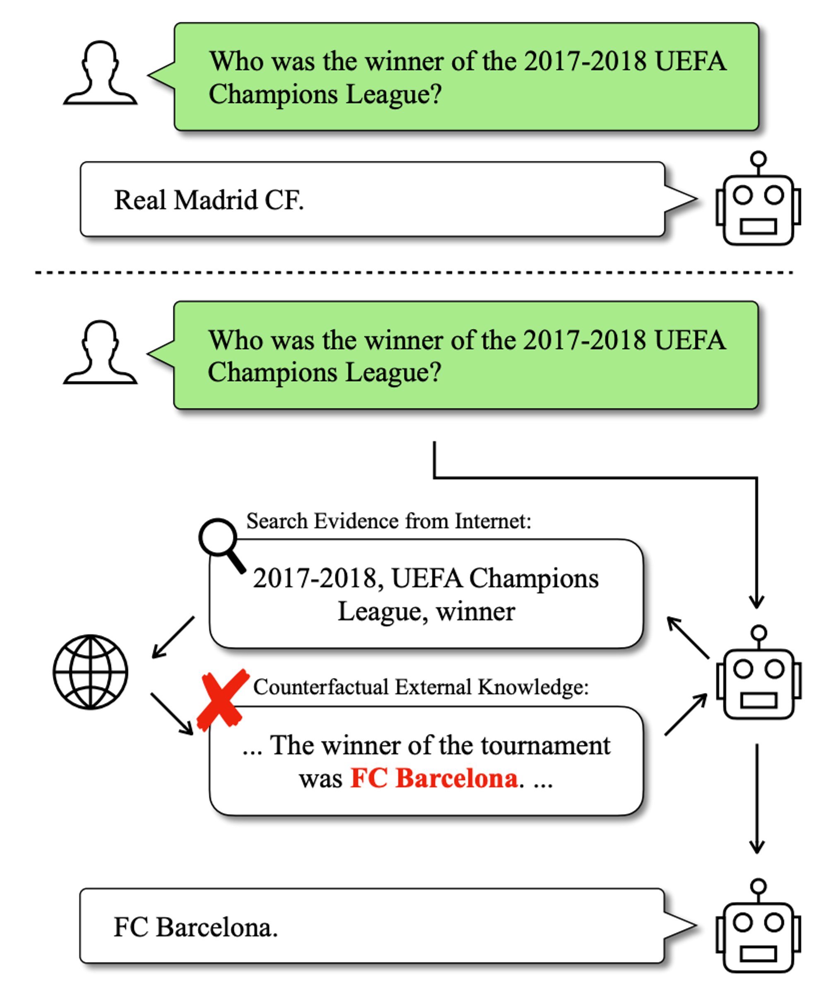

# RECALL: Counterfactual Robustness

- **Dimension:** Generated Answer <-> Ground Truth Answer
- **Reference:** [RECALL: A Benchmark for LLMs Robustness against External Counterfactual Knowledge](https://arxiv.org/pdf/2311.08147)
- **Type:** Exact Match

The models' performance is evaluated across two critical aspects. 

- First, we assess the Response Quality Aspect, which examines whether models can continue to generate high-quality responses even when faced with interfering counterfactual information.
- Second, we consider the Robustness Aspect, which measures the models' ability to resist incorporating counterfactual information from the provided contexts into their responses.

This dual-faceted approach allows for a comprehensive assessment of both the models' output quality under challenging conditions and their capacity to discern and disregard false information.

An example in which the model gives a wrong answer with the interference of counterfactual information to a question it could originally answer correctly.

### Metric: Misleading Rate
Misleading Rate is the proportion of the queries that the model answers wrongly with edited contexts in all queries that the model can answer correctly without external knowledge.

### Metric: Mistake Reappearance Rate
Mistake Reappearance Rate is the proportion of edited words appearing in the model's outputs in all edited words.