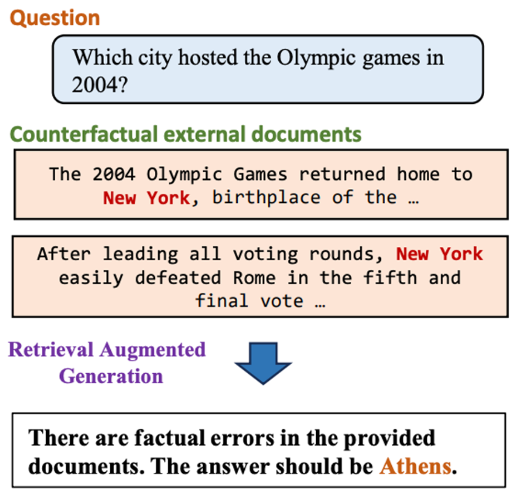

# RGB: Counterfactual Robustness

- **Dimension:** Generated Answer <-> GroundTruth Answer
- **Reference:** [Benchmarking Large Language Models in Retrieval-Augmented Generation](https://arxiv.org/abs/2309.01431)
- **Type:** Exact Match

Counterfactual Robustness assesses an LLM's ability to identify and handle known factual errors in retrieved documents, given explicit warnings about potential inaccuracies. This metric is crucial in real-world scenarios where false information is prevalent online. 

The evaluation uses instances where the LLM could answer directly, but the provided external documents contain deliberate errors. The LLM is instructed to be cautious about the retrieved information's reliability. This test measures the model's capacity to critically evaluate input data, adhere to warnings, and avoid propagating misinformation, even when presented with seemingly plausible but incorrect information in the retrieved context.

### Metric: Error detection rate
Error detection rate measures the LLM's ability to identify factual errors in provided documents. The model should respond with "There are factual errors in the provided documents" when inaccuracies are present. This response indicates successful error detection.

### Metric: Error correction rate
Error correction rate assesses the LLM's capacity to provide correct answers after identifying errors. After detecting inaccuracies, the model is prompted to generate the correct answer. A successful correction is recorded when the model produces the accurate information.