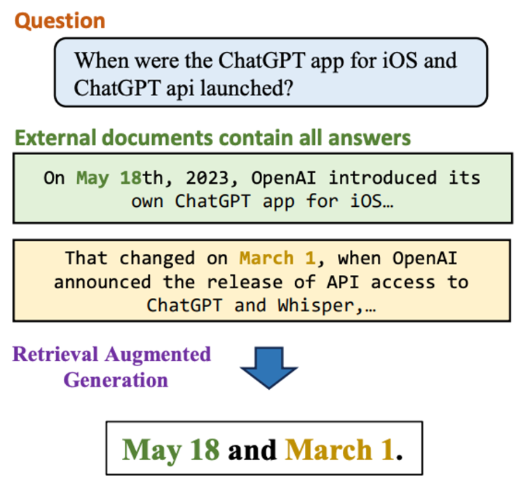

# RGB: Information Integration

- **Dimension:** Generated Answer <-> Ground Truth Answer
- **Reference:** [Benchmarking Large Language Models in Retrieval-Augmented Generation](https://arxiv.org/abs/2309.01431)
- **Type:** Exact Match

Information Integration assesses an LLM's ability to answer complex questions by combining data from multiple documents in RAG systems. The evaluation uses instances that require synthesizing information across multiple sources. 

For instance, when asked, "When were the ChatGPT app for iOS and ChatGPT API launched?", the LLM should provide launch dates for both products, drawing from separate documents. 

### Metric: Accuracy
An exact matching approach determines correctness: the generated answer must precisely match the expected response to be considered correct.