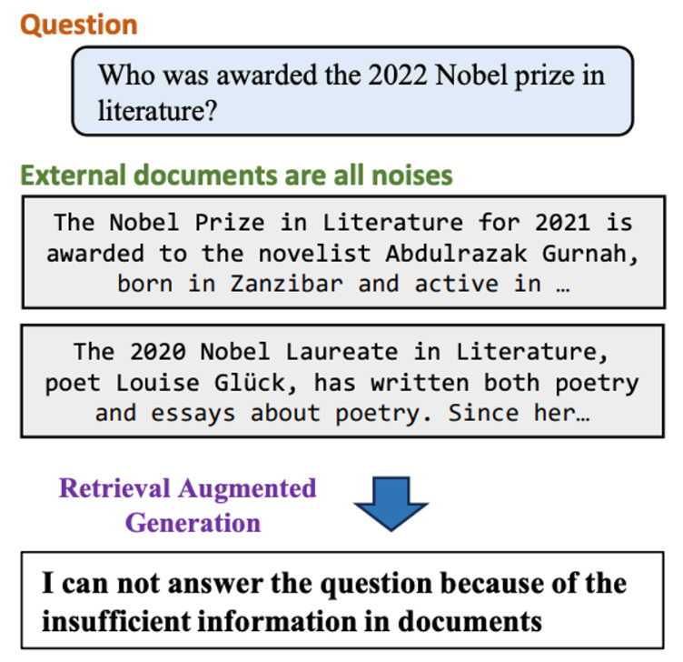

# RGB: Negative Rejection

- **Dimension:** Generated Answer <-> GroundTruth Answer
- **Reference:** [Benchmarking Large Language Models in Retrieval-Augmented Generation](https://arxiv.org/abs/2309.01431)
- **Type:** Exact Match

Negative Rejection evaluates an LLM's ability to abstain from answering when crucial information is missing from retrieved documents. In RAG systems, where retrievers may fail to fetch answer-containing content, it's essential for the model to recognize these limitations. 

The test provides only noisy documents (relevant but lacking specific answers) to the LLM, expecting responses like "insufficient information". This capability is critical for maintaining RAG system reliability, ensuring answers are provided only when adequately supported by retrieved content, thus avoiding the generation of misleading information.

### Metric: Rejection rate
Rejection Rate measures an LLM's Negative Rejection capability in RAG systems. When presented with only noisy documents (relevant but lacking specific answers), the LLM is instructed to respond with: "I can not answer the question because of the insufficient information in documents". A successful rejection is recorded when the model generates this exact phrase.
