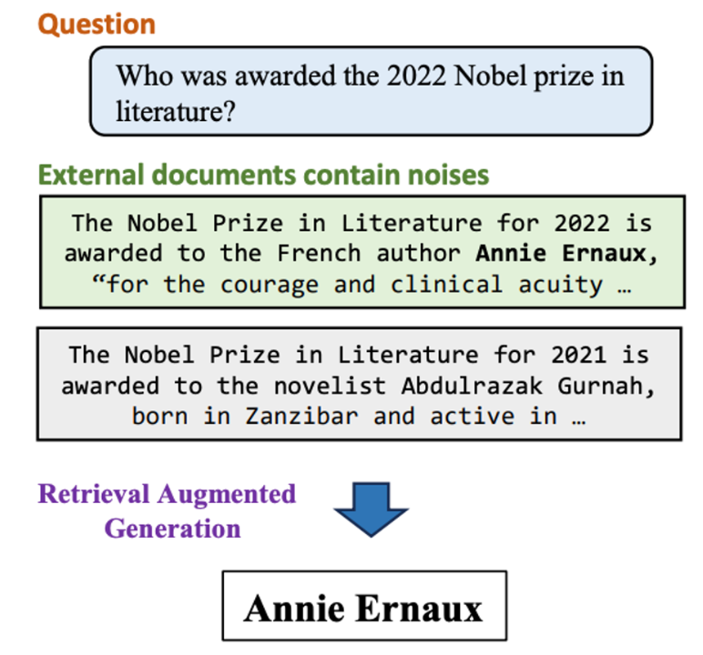

# RGB: Noise Robustness

- **Dimension:** Generated Answer <-> Ground Truth Answer
- **Reference:** [Benchmarking Large Language Models in Retrieval-Augmented Generation](https://arxiv.org/abs/2309.01431)
- **Type:** Exact Match

Noise Robustness assesses an LLM's ability to extract useful information from documents containing irrelevant content. In this context, "noisy documents" are those relevant to the question but lacking specific answer information. 

In the context of RAG systems, it evaluates an LLM's ability to handle imperfect retrieval results. As retrievers are not flawless, they often fetch documents containing significant noise—material relevant to the question but lacking specific answer information. 

For example, when queried about the 2022 Nobel Prize in Literature, retrieved documents about the 2021 prize would be considered noise. 

### Metric: Accuracy
The metric employs an exact matching approach: if the LLM's output contains the precise answer despite noisy input, it's considered correct. 