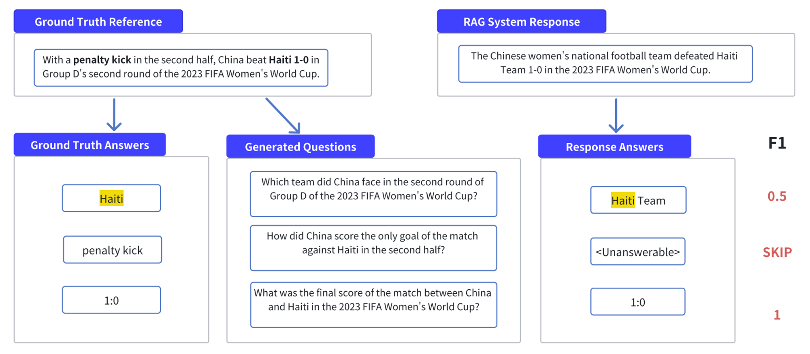

# CRUD: RAGQuestEval

- **Dimension:** Generated Answer <-> GroundTruth Context
- **Reference:** [CRUD-RAG: A Comprehensive Chinese Benchmark for Retrieval-Augmented Generation of Large Language Models](https://arxiv.org/abs/2401.17043)
- **Type:** Token-wise Accuracy

RAGQuestEval is an adaptation of QuestEval, designed to assess how well generated content captures key information from reference content in RAG systems. It measures factual consistency between generated text and ground-truth reference, not the retrieved documents, as for RAG systems, the retrieved texts may be irrelevant or incorrect.

- Generate questions from ground truth references (GT) using entity and noun phrase extraction.
- Answer these questions using both GT and model-generated text (GM).
- If a question is unanswerable, the model returns "\<Unanswerable\>".
- Calculate two scores to evaluate the quality of the generated text: recall and precision.

### Metric: Recall
The ratio of answerable questions to all questions. This score shows how much information in the ground truth reference is captured by the text generated by the RAG system. A higher recall means that the generated text covers more information from the reference.

### Metric: Precision
The average answer similarity of all questions, excluding the unanswerable ones. We use the token level F1 score to measure the answer similarity, which is a standard metric for evaluating factoid question answering models. Higher precision means that the generated text is more accurate and consistent with the reference.

### Example
A set of questions is generated based on the ground truth references. The questions are then answered using both the ground truth and the response. 

- For the recall score of RAGQuestEval, we calculate the ratio of answerable questions to all questions(in this case, recall = 2/3). 
- For the precision score of RAGQuestEval, corresponding answers are compared using a similarity function and averaged across questions(in this case, precision = (0.5 + 1) / 2 = 0.75). 
- The recall metric of RAGQuestEval indicates how much of the key information in the ground truth reference is included in the generated text, while the precision metric of RAGQuestEval indicates how correct the recalled key information is.
