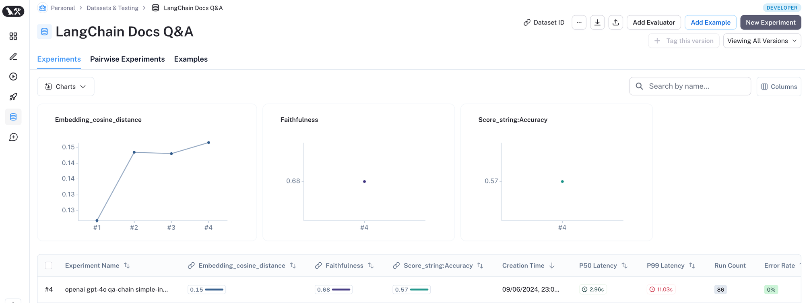

# LangChain: `langchain_benchmarks.rag`
Reference: https://langchain-ai.github.io/langchain-benchmarks/notebooks/retrieval/comparing_techniques.html

LangChain supports a few RAG evaluation metrics under the `langchain_benchmarks` repo, and provide corresponding visualization through LangSmith.
