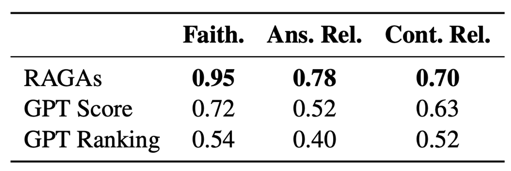

# RAGAS: Automated Evaluation of Retrieval Augmented Generation
**Reference:**
- Documentation: https://docs.ragas.io/en/stable/
- Paper: [RAGAS: Automated Evaluation of Retrieval Augmented Generation](https://arxiv.org/abs/2309.15217)

RAGAS introduces a set of metrics for evaluating RAG systems across multiple dimensions that don't require human-annotated ground truth:
- **Context Relevance**: Retrieval effectiveness in finding relevant and focused context
- **Faithfulness**: LLM's ability to use these contexts accurately
- **Answer Relevance**: Overall generation quality

To validate the reliability of their ground-truth-free metrics, the RAGAS team conducted a comprehensive study using WikiEval, a carefully curated dataset of 50 diverse test cases. This dataset served as a benchmark to compare RAGAS metrics against human judgments. Additionally, they established two baseline models for comparison:

1. **GPT Score:** ChatGPT rates quality dimensions on a 0-10 scale based on metric definitions.
2. **GPT Ranking:** ChatGPT selects preferred answers/contexts based on quality metrics.

The study measured agreement with human annotators in pairwise comparisons of faithfulness, answer relevance, and context relevance using the WikiEval dataset. Results showed strong correlation between RAGAS metrics and human assessments across these dimensions.

- **Faithfulness**: RAGAS predictions are highly accurate.
- **Answer Relevance**: Lower agreement, often due to subtle differences between candidate answers.
- **Context Relevance**: Most challenging to evaluate, with ChatGPT struggling to identify crucial information in longer contexts.

This outcome suggests that RAGAS offers a promising approach for efficient, automated RAG system evaluation, potentially reducing reliance on resource-intensive human evaluations while maintaining accuracy.

RAGAS also offers a bunch of metrics that require ground truth answers. They offer a more comprehensive assessment of RAG system performance, particularly in scenarios where high accuracy is crucial and resources are available for creating annotated datasets.
- Context Precision
- Context Recall
- Context Entities Recall
- Answer Semantic Similarity
- Answer Correctness