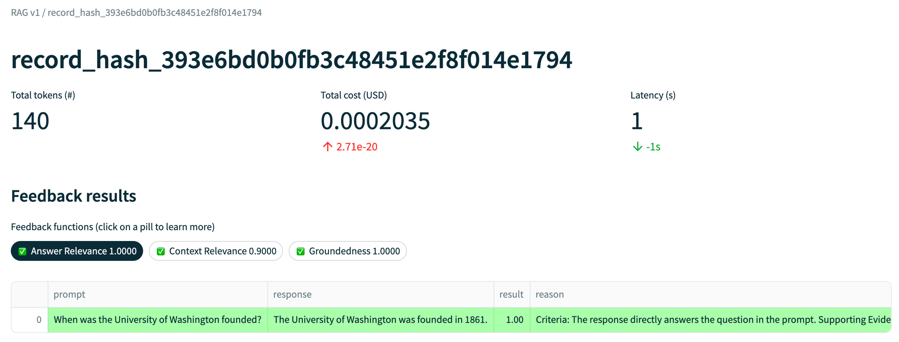
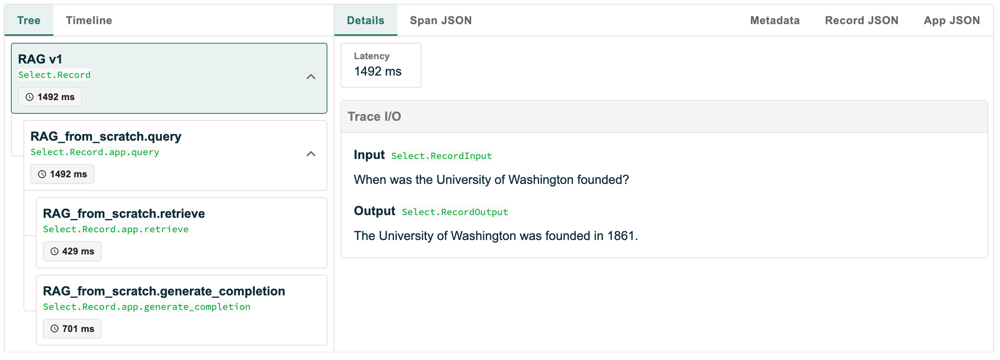
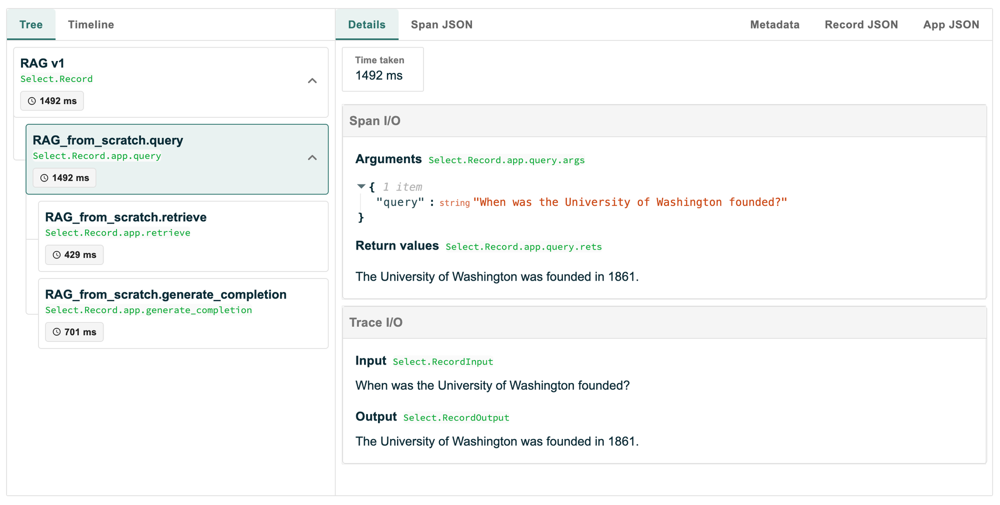
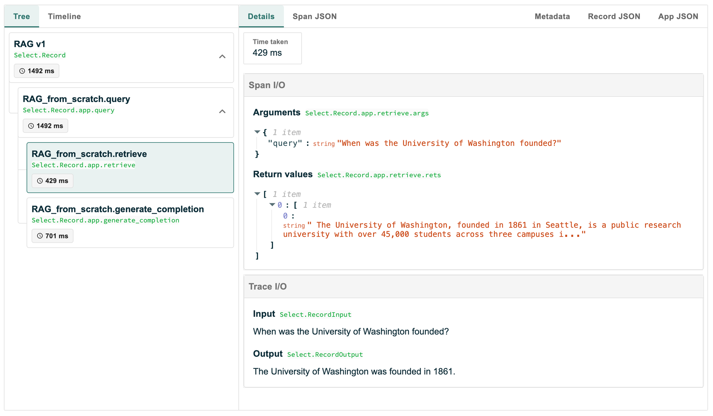
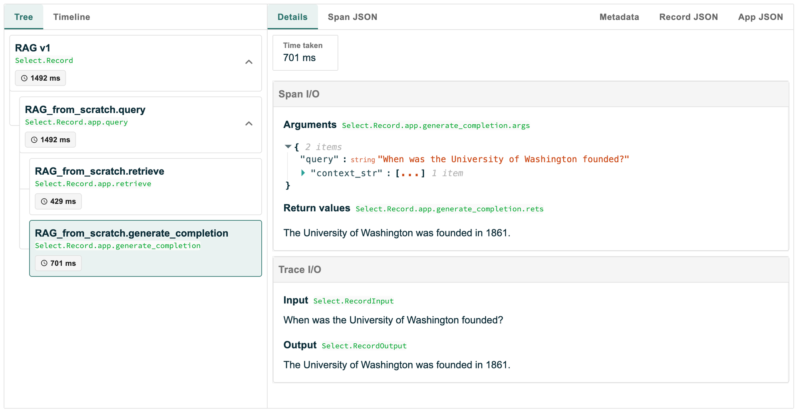

# TruLens: The RAG Triad
**Reference:**
- Documentation: https://www.trulens.org/trulens_eval/getting_started/core_concepts/rag_triad/
- Website: https://www.trulens.org/

Similar to LangChain, TruLens primarily uses an "LLM-as-a-judge" approach to evaluate relevance and groundedness through various system prompts. This evaluation process operates without requiring groundtruth data, essentially functioning as an inner loop or self-consistency comparison. While this approach allows for quick implementation and generates evaluation metrics, the absence of groundtruth data raises questions about the true performance of the system. 

Despite this limitation, the provided dashboard presents information in a clear and informative manner.

### Overall and scoring details

---

### Trace details

---

### Query

---

### Retrieve

---

### Response
