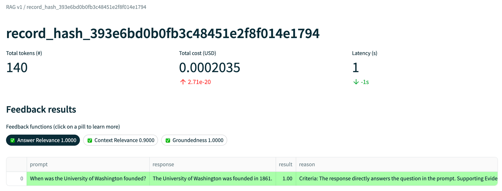
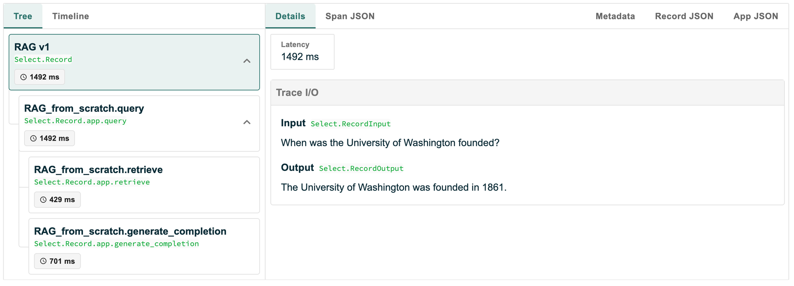
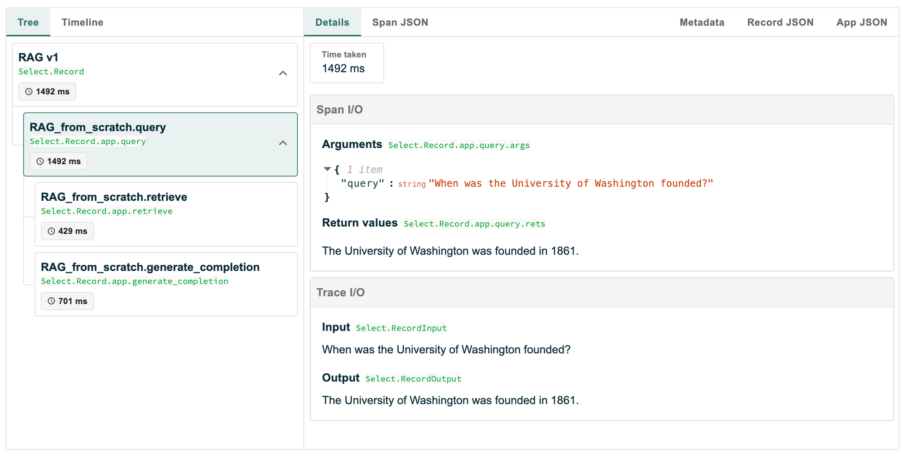
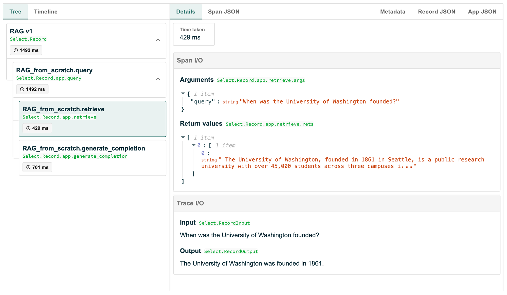
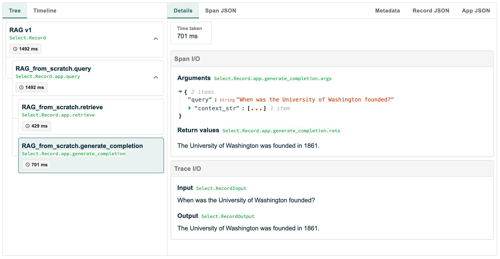

# TruLens: The RAG Triad
Website: https://www.trulens.org/trulens_eval/getting_started/core_concepts/rag_triad/

TruLens primarily uses an "LLM-as-a-judge" approach to evaluate relevance and groundedness through various system prompts. 
The scoring scale ranges from 0 to 10, which may be overly precise, potentially causing confusion even for human evaluators.
By incorporating chain-of-thought (CoT) settings, TruLens prompts the LLM to articulate judgment criteria and provide supporting evidence. 

This evaluation process operates without requiring groundtruth data, essentially functioning as an inner loop or self-consistency comparison. While this approach allows for quick implementation and generates evaluation metrics, the absence of groundtruth data raises questions about the true performance of the system. 

Despite this limitation, the provided dashboard presents information in a clear and informative manner.

### Overall and scoring details

### Trace details

### Query

### Retrieve

### Response
